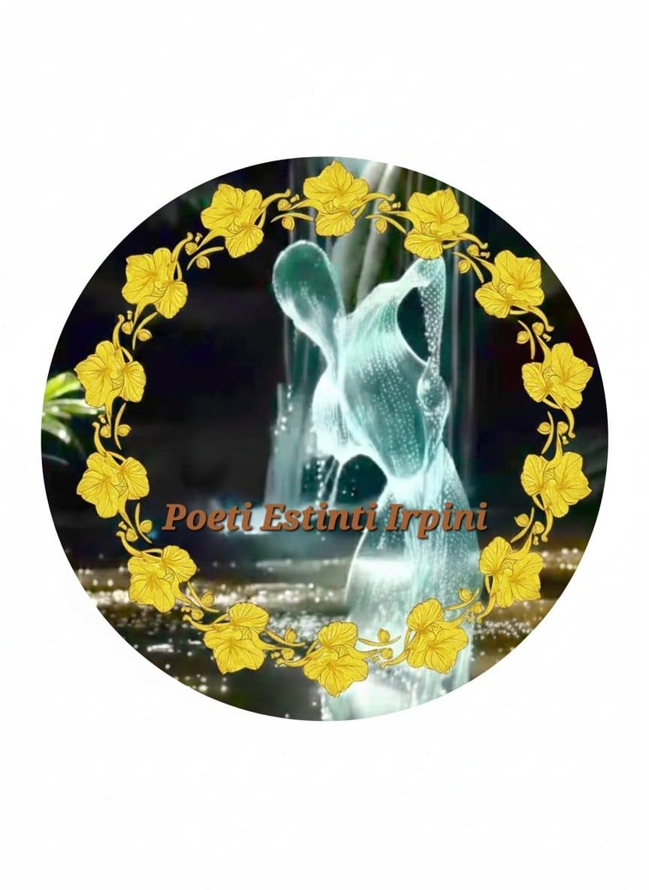

  

**"I Poeti Estinti Irpini"** è un'associazione culturale no profit nata con l'intento di preservare, promuovere e diffondere la cultura in tutte le sue forme, con una profonda attenzione alle radici e al patrimonio immateriale del territorio irpino.

Cosa facciamo:

- *Creazione di Eventi*: Organizziamo rassegne, reading, laboratori e incontri pubblici volti a riportare la cultura al centro della vita comunitaria.

- *Produzione Poetica*: Diamo voce a talenti emergenti e riscopriamo i grandi classici, utilizzando la poesia come strumento di riflessione, emozione e connessione sociale.

- *Valorizzazione dell'Irpinia*: Il nostro impegno principale è diffondere la ricchezza storica, letteraria e paesaggistica dell'Irpinia. Tramite i nostri eventi, trasformiamo luoghi e tradizioni locali in palcoscenici vivi per la parola e l'arte.

<section class="home-poesie">
  <h2 class="section-title">Concorsi e pubblicazioni</h2>
  

    
      <a href="{{ poesia.url }}" class="poesia-card-mini">
        <h3>{{ post.title }}</h3>
        <h4>{{ post.author }}</h4>
      </a>
    
  
  
</section>

<section class="home-poesie">
  <h2 class="section-title">Ultimi Versi dall'Irpinia</h2>
  

    
      <a href="{{ poesia.url }}" class="poesia-card-mini">
        <h3>{{ poesia.title }}</h3>
        <h4>{{ poesia.author }}</h4>
      </a>
    
  
  
</section>

  

    {{ site.poesie.size }}
    Poesie Raccolte
  

  

      <a class="link-leggile" href='{{ site.baseurl }}/poesie'>Leggile tutte...</a>
  
  

